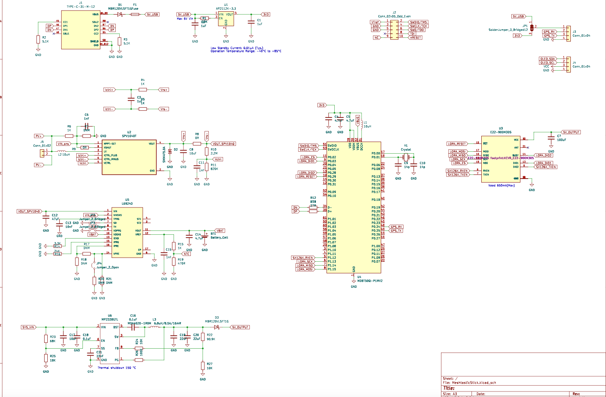

# MeshtasticStick

1. 支持太陽能（0.3V~5.5V）
2. 支持寬壓輸入（4.5V~28V）
3. TypeC 供電(輸入最少5V/1.5A)，如無充電狀況下約0.8A
4. NRF52 不支持WI-FI
5. 預留I2C,GPS接口(GPS可使用Jumper切換電壓3v3/5v0)

# 原理圖

# 主要零件
1. MDBT50Q-P1MV2
描述: 這是由Raytac Corporation生產的一款BLE模塊，基於Nordic Semiconductor的nRF52840晶片。此模塊支持Bluetooth 5.1規範，具有低功耗藍牙(BLE)功能。
優勢: 具有較大的傳輸範圍、高數據傳輸速率和低能耗。支持多種無線通訊協議，包括藍牙、ANT和2.4 GHz射頻。此外，內建32位ARM Cortex-M4 CPU，具有豐富的GPIO和接口，適合複雜的物聯網(IoT)應用。

2. SPV1040（voltage range from 0.3 V to 5.5 V）
描述: SPV1040是STMicroelectronics的一款高效率太陽能充電控制器，適用於低功耗應用和可攜式太陽能系統。
優勢: 能夠在廣泛的太陽照射條件下有效提高能量收集效率，支持最大功率點追蹤(MPPT)技術，以最大化太陽能板的能量輸出。此IC具有過載保護和熱保護功能，能確保系統的穩定與安全。

3. L6924 (取代LT4056系列)
描述: L6924是一款用於單節鋰離子或鋰聚合物電池的充電管理IC，由STMicroelectronics製造。
優勢: 這個充電器支持調整充電電流和電壓，以適應不同電池的需求。它包括內部功率晶體管和電流感測功能，無需外部許多元件，非常適合便攜式設備。

4. MP2338 (4.5V to 28V Operating Input Range)
描述: MP2338是由MPS公司生產的一款同步降壓轉換器，用於將更高的電壓轉換為更低的電壓，同時提供高效率和優異的負載調節。
優勢: 它具有高達95%的轉換效率，非常適合需要高效能轉換的應用。此外，其具有緊湊的尺寸和低靜態功耗，非常適合電池供電的系統。

5. E22-900M30/33 1W LORA
描述: Ebyte製造的E22-900M30/33是一款高功率LoRa模塊，工作在900 MHz頻段，提供長距離無線通信。
優勢: 此模塊的最大發射功率達到1瓦特，能夠實現極遠的通信距離。支持LoRa和FSK調制，具有良好的抗干擾性能和低功耗特性。此外，模塊的配置靈活，支持多種工作模式，非常適合需要遠距離數據傳輸的物聯網應用。

# TODO
- [ ] 確認SPV1040工作狀態
- [ ] L6924 ST1,ST2確認設計方式
- [ ] 確認4.2v供電

#ref

- 太陽能設計文件
https://static5.arrow.com/pdfs/2011/10/8/19/12/15/660/st_/auto/steval-isv012v1_schematic.pdf